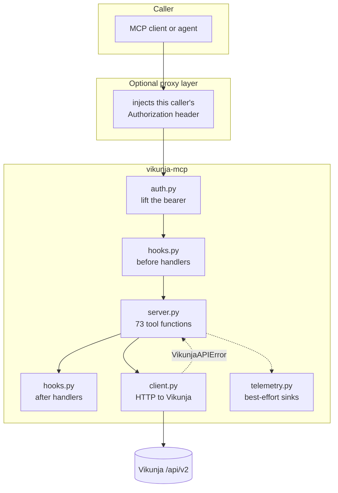

# Architecture

What the pieces are, why the boundaries fall where they do, and which invariants are
load-bearing. For how to *use* the server see [README.md](README.md); for how to connect a
client see [docs/clients.md](docs/clients.md).

---

## The one decision everything else follows from

**This server holds no Vikunja credentials.** It reads the caller's bearer token off the
incoming request and forwards it upstream unchanged.

Every other structural choice here is downstream of that. The server is stateless because it
has nothing to keep; it has no user model because Vikunja already has one; it has no
authorisation layer because the token *is* the authorisation and Vikunja adjudicates it.

The dotted edges are the ones that must never be able to break a call: telemetry is
fire-and-forget, and a sink being down is not an error the caller sees.

---

## Modules

| Module | Owns | Must never |
|---|---|---|
| `config.py` | Environment parsing, startup refusals | Reach the network. It is pure parsing, which is what makes `--check` meaningful |
| `auth.py` | Resolving the acting token per request | Fall back to an ambient credential on a network transport |
| `client.py` | HTTP to Vikunja, error normalisation | Hold a token of its own; it is handed one per call |
| `server.py` | Tool definitions, validation, response shaping | Import `contrib/` implicitly |
| `markers.py` | Structured markers embedded in descriptions | Emit a value that could forge a sibling marker |
| `hooks.py` | Pre/post extension-hook registry | Swallow handler exceptions |
| `telemetry.py` | Metrics and span export | Raise into a tool call |
| `contrib/` | Optional, opt-in extras | Be imported by default |
| `exceptions.py` | `ConfigError`, `AuthError`, `VikunjaAPIError` | — |

---

## Invariants

These are the things a change should not quietly break. Each has a test, and most have an
incident behind them.

### 1. The credential is per-request, never ambient

`auth.caller_token()` reads `Authorization` off the request. There is exactly one exception:
under `stdio` there is no HTTP request at all, so `VIKUNJA_TOKEN` supplies it. The two
guards that keep that narrow are independent — `config.get_settings()` refuses a token on a
network transport at startup, and `auth` additionally requires that no HTTP request be in
scope before using the fallback.

The subtlety worth knowing: `get_http_headers()` strips `authorization` by default, because
it is on FastMCP's deny-forward list. Reading it requires `include={"authorization"}`
explicitly. Dropping that argument breaks every authenticated call while leaving any
"rejects an anonymous call" test perfectly green — which is why the smoke test asserts the
*positive* case too.

### 2. Configuration fails closed, at startup, loudly

Three combinations are refused before the server binds:

| Condition | Why refusing beats warning |
|---|---|
| No `VIKUNJA_URL` | A baked default would let a misconfigured deployment silently talk to someone else's instance |
| `stdio` without `VIKUNJA_TOKEN` | Otherwise it starts cleanly, registers every tool, and fails 100% of calls at invocation time |
| `VIKUNJA_TOKEN` on a network transport | A static token on a shared port collapses every caller into one Vikunja identity — silently, with no symptom until someone asks who changed a ticket |

The third is a security boundary, not ergonomics. Note the check is `!= "stdio"` rather than
`== "http"`: enumerating the *safe* case is what keeps it correct as transports are added.

### 3. A bare number is always a global task id

`#454` is a ticket *index*, unique only per project. `454` is a global id. The two are
different address spaces and the asymmetry is deliberate: guessing between them is exactly
what caused an agent to silently mutate three unrelated tickets (vikunja#331). Unscoped
resolution of `#N` **raises** on more than one match rather than picking a winner.

### 4. `/health` is unauthenticated and therefore carries no configuration

It is the one route that answers without a token. It returns status and version, does not
echo `VIKUNJA_URL` or anything else, and deliberately does not probe upstream Vikunja — this
server is stateless and recovers on its own, so a Vikunja restart marking the container
unhealthy would cost a restart loop and buy nothing.

### 5. Telemetry cannot break a tool call

Sinks are best-effort and fire-and-forget. The known trap is the inverse of a crash: setting
`OTEL_EXPORTER_OTLP_ENDPOINT` *without* the `[telemetry]` extra installed does not fail — it
logs `otlp_import_failed` once and then exports nothing forever. The acceptance check is the
startup log line, never the presence of the env var.

### 6. The SSRF guard judges the resolved address, not the name

`_validate_webhook_target` resolves the hostname and checks every returned address. Under
split-horizon DNS a public-looking hostname can resolve to a private one — common wherever a
reverse proxy fronts internal services — and it is refused for that reason. It also fails
closed on an unresolvable host. Vikunja has its own outgoing-request filter, but it can be
disabled, so this check may be the only one in the path.

---

## Request lifecycle

1. **Transport** delivers a tool call (streamable HTTP, or stdio).
2. **`auth.caller_token()`** lifts the bearer. No header and no stdio fallback → `AuthError`,
   and nothing further runs.
3. **Before-hooks** run, keyed on tool name. An exception here aborts the call — hooks are a
   control point, not decoration.
4. **The tool function** validates arguments and shapes the request.
5. **`client.request()`** calls Vikunja with the forwarded token and normalises failures into
   `VikunjaAPIError`.
6. **Response shaping** trims the payload — compact by default — and attaches signals such as
   staleness.
7. **After-hooks** run.
8. **Telemetry** records call count, error count and upstream latency, plus a `tool.<name>`
   span. Failures here are swallowed.

An error at step 2 and an error at step 5 are deliberately distinguishable. That difference
is what the image smoke test asserts: it is the only evidence available, without a live
Vikunja, that the token was genuinely lifted and forwarded rather than ignored.

---

## Testing shape

- **Unit and wire tests** cover every tool, pinning each to the correct HTTP verb.
- **`scripts/verify-routes.py`** sweeps every implemented route against a live Vikunja
  router, catching a verb that is right in the test double and wrong in reality. It is
  opt-in and never runs on the PR path.
- **`scripts/smoke-image.sh`** asserts the container: fail-closed startup, non-root, shipped
  filesystem contents, a dependency audit of every `site-packages` tree, `/health`, the
  tool-call contract, and `--check`. One definition, called from both `ci.yml` and
  `release.yml`, so the PR path and the publish path cannot drift.
- **Coverage floor** is measured and dated in `pyproject.toml`, and ratcheted rather than
  shaved.

---

Related: [CONTRIBUTING.md](CONTRIBUTING.md) · [SECURITY.md](SECURITY.md) ·
[AGENTS.md](AGENTS.md) · [docs/index.md](docs/index.md)
