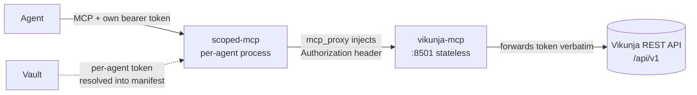

[](https://claude.ai/code)
[](https://opensource.org/licenses/MIT)

# vikunja-mcp

A [FastMCP](https://github.com/jlowin/fastmcp) server that exposes the
[Vikunja](https://vikunja.io) REST API as MCP tools — projects, tasks, labels, comments,
saved filters, and webhooks — designed for multi-agent use behind
[scoped-mcp](https://github.com/TadMSTR/scoped-mcp).

## Why it's shaped this way — token passthrough

This server holds **no** Vikunja credentials. Vikunja issues a per-user API token, and each
agent has its own account. Rather than teaching this server to fetch five tokens from Vault
and pick one per call, it stays stateless: it reads the caller's bearer token off the
incoming request and forwards it to Vikunja unchanged.

The token is injected upstream by each agent's own scoped-mcp instance (from its manifest,
resolved out of Vault). The payoff:

- **Small blast radius** — a compromise of this process exposes one in-flight request's
  token, never the whole set of agent credentials.
- **Real attribution** — every call reaches Vikunja *as the agent that made it*, so task
  authorship, comments, and audit trails are per-agent for free.



Because the token *is* the credential, a request with no `Authorization` header is rejected
fail-closed (`AuthError`) — there is no ambient fallback.

## Tools

As of v0.2.0 the server covers the full Vikunja resource surface — 71 tools, each pinned to
the correct verb by a wire test against the live Swagger spec.

| Group | Tools |
|-------|-------|
| Identity | `whoami` |
| Projects | `project_list`, `project_get`, `project_create`, `project_update`, `project_delete` |
| Project sharing | `project_team_list`, `project_team_add`, `project_team_update`, `project_team_remove`, `project_user_list`, `project_user_add`, `project_user_update`, `project_user_remove`, `project_share_list`, `project_share_get`, `project_share_create`, `project_share_delete` |
| Tasks | `task_list`, `task_search`, `task_get`, `task_create`, `task_update`, `task_delete`, `tasks_bulk_update` |
| Assignees | `task_assignee_list`, `task_assignee_add`, `task_assignee_remove`, `task_assignees_add_bulk` |
| Relations / reminders | `task_relation_add`, `task_relation_remove`, `task_reminders_set` |
| Kanban buckets / views | `bucket_list`, `bucket_create`, `bucket_update`, `bucket_delete`, `task_bucket_move`, `view_list`, `view_get`, `view_create`, `view_update`, `view_delete` |
| Labels | `label_list`, `label_get`, `label_create`, `label_update`, `label_delete`, `task_label_add`, `task_label_remove` |
| Comments | `comment_list`, `comment_create`, `comment_delete` |
| Filters | `filter_get`, `filter_create`, `filter_update`, `filter_delete` |
| Attachments | `attachment_list`, `attachment_upload`, `attachment_delete` |
| Teams | `team_list`, `team_get`, `team_create`, `team_update`, `team_delete`, `team_member_add`, `team_member_remove`, `team_member_toggle_admin` |
| Webhooks | `webhook_events`, `webhook_list`, `webhook_create`, `webhook_delete` |

> Vikunja's REST idiom: **PUT creates, POST updates.** The tool names hide this, but it's
> why `*_create` and `*_update` hit the same path with different verbs.

Notes:

- **No `filter_list`** — Vikunja has no `GET /filters`; saved filters are exposed as
  pseudo-projects, so list them via `project_list` and fetch with `filter_get`.
- Project sharing permission ints: `0` = read, `1` = write, `2` = admin.
- Attachments upload base64 (multipart on the wire); `attachment_upload` handles the
  encoding.

## Markdown descriptions & comments

`description` on `task_create`/`task_update`/`project_create`/`project_update`, and the
comment body on `comment_create`, accept plain **markdown**. Vikunja itself stores these
fields as HTML (TipTap rich text), so the server converts markdown to HTML server-side
before writing, then sanitizes the result with an allowlist HTML cleaner (`nh3.clean()`) —
raw HTML embedded in agent-authored markdown (e.g. a stray `<script>` tag) is stripped, not
passed through. No caller-side conversion is needed; just write normal markdown.

## Extension hooks

Every tool is wrapped by `server.instrument`, which fires a **pre/post hook** chain around
each call — third parties can intercept or mutate calls without editing the server:

```
call → run_before_hooks(tool, kwargs) → [telemetry span] → tool(**kwargs)
     → run_after_hooks(tool, result) → return
```

Register handlers with `register_before(tool, handler)` / `register_after(tool, handler)`
(`hooks.py`). Handlers run in registration order and propagate exceptions — they are not
fire-and-forget. `contrib/audit_log.py` is a worked example that records
actor/tool/args-hash without ever logging raw arguments or the bearer token. Full contract
and handler signatures: [`docs/extension-hooks.md`](docs/extension-hooks.md).

## Configuration

All configuration is environment variables. No token is ever configured here.

| Var | Purpose | Default |
|-----|---------|---------|
| `VIKUNJA_URL` | Base URL of the Vikunja instance (no `/api/v1`) | `https://vikunja.helmforge.me` |
| `VIKUNJA_HOST` | Bind address | `127.0.0.1` |
| `VIKUNJA_PORT` | Bind port | `8501` |
| `VIKUNJA_TRANSPORT` | `http` or `stdio` | `http` |
| `VIKUNJA_REQUEST_TIMEOUT` | Upstream timeout (seconds) | `30` |
| `LOG_LEVEL` | Log verbosity | `INFO` |
| `OTEL_EXPORTER_OTLP_ENDPOINT` | Enable OTLP spans + metrics (needs `[telemetry]` extra) | off |
| `VIKUNJA_INFLUXDB3_URL` | Enable the InfluxDB 3 metrics sink | off |
| `VIKUNJA_INFLUXDB3_TOKEN` | InfluxDB 3 auth token | `""` |
| `VIKUNJA_INFLUXDB3_DATABASE` | InfluxDB 3 target database | `vikunja_mcp` |
| `VIKUNJA_NATS_URL` | Enable the NATS metrics sink (e.g. `nats://127.0.0.1:4222`) | off |
| `VIKUNJA_NATS_SUBJECT` | NATS subject for metric events | `vikunja.mcp.metrics` |

## Run

```bash
pip install -e ".[dev]"
VIKUNJA_URL=https://vikunja.example.com vikunja-mcp
```

Then, as a caller, present a Vikunja API token as a bearer:

```bash
curl -H "Authorization: Bearer <vikunja-token>" http://127.0.0.1:8501/mcp/...
```

In production this header is set by scoped-mcp, not by hand — see
[`docs/forge.md`](docs/forge.md) for the manifest wiring.

## Telemetry

Logging (structlog JSON) is **on by default**. Metrics and tracing are **off by default**
and enable per-backend when the relevant env var is set — install the extra with
`pip install 'vikunja-mcp[telemetry]'`. Every tool call records call count, error count, and
upstream latency, plus an OTLP span (`tool.<name>`). Sinks are best-effort and
fire-and-forget: a telemetry backend being down never breaks a tool call. Forge ships
`influxdb:3-core`, so the InfluxDB sink uses the **v3** write API. See
[`docs/telemetry.md`](docs/telemetry.md) for the full backend matrix.

## Development

```bash
pip install -e ".[dev]"
ruff check src/ tests/
ruff format --check src/ tests/
pytest --cov=vikunja_mcp --cov-report=term-missing
```

## Deployment

Runs as a PM2 service on forge, fronted by scoped-mcp. See [`docs/forge.md`](docs/forge.md)
for the PM2 config, the scoped-mcp manifest, and the per-agent token wiring.
