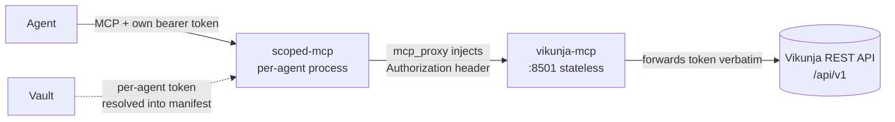

[](https://claude.ai/code)
[](https://opensource.org/licenses/MIT)

# vikunja-mcp

A [FastMCP](https://github.com/jlowin/fastmcp) server that exposes the
[Vikunja](https://vikunja.io) REST API as MCP tools — projects, tasks, labels, comments,
saved filters, and webhooks — designed for multi-agent use behind
[scoped-mcp](https://github.com/TadMSTR/scoped-mcp).

## Why it's shaped this way — token passthrough

This server holds **no** Vikunja credentials. Vikunja issues a per-user API token, and each
agent has its own account. Rather than teaching this server to fetch five tokens from Vault
and pick one per call, it stays stateless: it reads the caller's bearer token off the
incoming request and forwards it to Vikunja unchanged.

The token is injected upstream by each agent's own scoped-mcp instance (from its manifest,
resolved out of Vault). The payoff:

- **Small blast radius** — a compromise of this process exposes one in-flight request's
  token, never the whole set of agent credentials.
- **Real attribution** — every call reaches Vikunja *as the agent that made it*, so task
  authorship, comments, and audit trails are per-agent for free.



Because the token *is* the credential, a request with no `Authorization` header is rejected
fail-closed (`AuthError`) — there is no ambient fallback.

## Tools

| Group | Tools |
|-------|-------|
| Identity | `whoami` |
| Projects | `project_list`, `project_get`, `project_create`, `project_update`, `project_delete` |
| Tasks | `task_list`, `task_search`, `task_get`, `task_create`, `task_update`, `task_delete` |
| Labels | `label_list`, `label_get`, `label_create`, `label_update`, `label_delete`, `task_label_add`, `task_label_remove` |
| Comments | `comment_list`, `comment_create`, `comment_delete` |
| Filters | `filter_get`, `filter_create`, `filter_update`, `filter_delete` |
| Webhooks | `webhook_events`, `webhook_list`, `webhook_create`, `webhook_delete` |

> Vikunja's REST idiom: **PUT creates, POST updates.** The tool names hide this, but it's
> why `*_create` and `*_update` hit the same path with different verbs.

## Configuration

All configuration is environment variables. No token is ever configured here.

| Var | Purpose | Default |
|-----|---------|---------|
| `VIKUNJA_URL` | Base URL of the Vikunja instance (no `/api/v1`) | `https://vikunja.helmforge.me` |
| `VIKUNJA_HOST` | Bind address | `127.0.0.1` |
| `VIKUNJA_PORT` | Bind port | `8501` |
| `VIKUNJA_TRANSPORT` | `http` or `stdio` | `http` |
| `VIKUNJA_REQUEST_TIMEOUT` | Upstream timeout (seconds) | `30` |
| `LOG_LEVEL` | Log verbosity | `INFO` |
| `OTEL_EXPORTER_OTLP_ENDPOINT` | Enable OTLP tracing (needs `[telemetry]` extra) | off |

## Run

```bash
pip install -e ".[dev]"
VIKUNJA_URL=https://vikunja.example.com vikunja-mcp
```

Then, as a caller, present a Vikunja API token as a bearer:

```bash
curl -H "Authorization: Bearer <vikunja-token>" http://127.0.0.1:8501/mcp/...
```

In production this header is set by scoped-mcp, not by hand — see
[`docs/forge.md`](docs/forge.md) for the manifest wiring.

## Development

```bash
pip install -e ".[dev]"
ruff check src/ tests/
ruff format --check src/ tests/
pytest --cov=vikunja_mcp --cov-report=term-missing
```

## Deployment

Runs as a PM2 service on forge, fronted by scoped-mcp. See [`docs/forge.md`](docs/forge.md)
for the PM2 config, the scoped-mcp manifest, and the per-agent token wiring.
