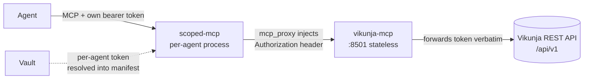

[](https://claude.ai/code)
[](https://opensource.org/licenses/MIT)

# vikunja-mcp

A [FastMCP](https://github.com/jlowin/fastmcp) server that exposes the
[Vikunja](https://vikunja.io) REST API as MCP tools — projects, tasks, labels, comments,
saved filters, and webhooks — designed for multi-agent use behind
[scoped-mcp](https://github.com/TadMSTR/scoped-mcp).

## Why it's shaped this way — token passthrough

Run over HTTP, this server holds **no** Vikunja credentials. Vikunja issues a per-user API
token, and each agent has its own account. Rather than teaching this server to fetch five tokens from Vault
and pick one per call, it stays stateless: it reads the caller's bearer token off the
incoming request and forwards it to Vikunja unchanged.

The token is injected upstream by each agent's own scoped-mcp instance (from its manifest,
resolved out of Vault). The payoff:

- **Small blast radius** — a compromise of this process exposes one in-flight request's
  token, never the whole set of agent credentials.
- **Real attribution** — every call reaches Vikunja *as the agent that made it*, so task
  authorship, comments, and audit trails are per-agent for free.


```mermaid
flowchart LR
    A[Agent] -->|MCP + own bearer token| S[scoped-mcp<br/>per-agent process]
    S -->|mcp_proxy injects<br/>Authorization header| V[vikunja-mcp<br/>:8501 stateless]
    V -->|forwards token verbatim| K[(Vikunja REST API<br/>/api/v1)]
    W[Vault] -.->|per-agent token<br/>resolved into manifest| S
```

Because the token *is* the credential, a request with no `Authorization` header is rejected
fail-closed (`AuthError`) — there is no ambient fallback.

### Single-user stdio

Passthrough needs a request to pass a token through, so it cannot work over stdio — there
is no HTTP request and therefore no header. If you are running this the ordinary MCP way
(one subprocess, one user, launched by your client), set both:

```bash
VIKUNJA_TRANSPORT=stdio
VIKUNJA_TOKEN=<your Vikunja API token>
```

Neither half is optional. `stdio` without a token refuses to start, rather than starting
cleanly and failing every tool call the way it used to. And `VIKUNJA_TOKEN` with a network
transport **also** refuses to start: a shared static token on a port makes every caller
reach Vikunja as one identity, which silently destroys the per-agent attribution above. See
[SECURITY.md](SECURITY.md) for the full rule.

## Tools

As of v0.2.0 the server covers the full Vikunja resource surface — 71 tools, each pinned to
the correct verb by a wire test against the live Swagger spec.

| Group | Tools |
|-------|-------|
| Identity | `whoami` |
| Projects | `project_list`, `project_get`, `project_create`, `project_update`, `project_delete` |
| Project sharing | `project_team_list`, `project_team_add`, `project_team_update`, `project_team_remove`, `project_user_list`, `project_user_add`, `project_user_update`, `project_user_remove`, `project_share_list`, `project_share_get`, `project_share_create`, `project_share_delete` |
| Tasks | `task_list`, `task_search`, `task_get`, `task_create`, `task_update`, `task_delete`, `tasks_bulk_update` |
| Assignees | `task_assignee_list`, `task_assignee_add`, `task_assignee_remove`, `task_assignees_add_bulk` |
| Relations / reminders | `task_relation_add`, `task_relation_remove`, `task_reminders_set` |
| Kanban buckets / views | `bucket_list`, `bucket_create`, `bucket_update`, `bucket_delete`, `task_bucket_move`, `view_list`, `view_get`, `view_create`, `view_update`, `view_delete` |
| Labels | `label_list`, `label_get`, `label_create`, `label_update`, `label_delete`, `task_label_add`, `task_label_remove` |
| Comments | `comment_list`, `comment_create`, `comment_delete` |
| Filters | `filter_get`, `filter_create`, `filter_update`, `filter_delete` |
| Attachments | `attachment_list`, `attachment_upload`, `attachment_delete` |
| Teams | `team_list`, `team_get`, `team_create`, `team_update`, `team_delete`, `team_member_add`, `team_member_remove`, `team_member_toggle_admin` |
| Webhooks | `webhook_events`, `webhook_list`, `webhook_create`, `webhook_delete` |

> Vikunja's REST idiom: **PUT creates, POST updates.** The tool names hide this, but it's
> why `*_create` and `*_update` hit the same path with different verbs.

Notes:

- **No `filter_list`** — Vikunja has no `GET /filters`; saved filters are exposed as
  pseudo-projects, so list them via `project_list` and fetch with `filter_get`.
- Project sharing permission ints: `0` = read, `1` = write, `2` = admin.
- Attachments upload base64 (multipart on the wire); `attachment_upload` handles the
  encoding.

## Ticket numbers vs. task ids

Vikunja gives every task **two** numbers, and mixing them up silently edits the wrong
ticket. `id` is global and is what `/tasks/{id}` and every tool take. `index` is a counter
*per project*, and it is what the UI displays as `#454`.

They are not the same number and the difference is not a constant — across one real corpus
the offset ran 8, then 11, then 19. That is the shape of gap that teaches you a rule which
then quietly fails on an older ticket.

So, as of v0.5.0:

- **No tool returns a bare `index`.** `identifier` (the string `"#454"`) is returned
  instead. Being a string, it cannot be passed where an int id is expected without an
  obvious type error.
- **Every tool that takes a `task_id` also accepts a ticket reference.** It is resolved
  server-side with one filtered lookup:

  | You pass | Meaning | Lookup? |
  |---|---|---|
  | `473` or `"473"` | global task id | no |
  | `"#454"` | ticket number | one call |
  | `"#456 (id 475)"` | ticket number with the id spelled out | no |

- **Every projected read returns a `url`**, built from `id`. Constructing `/tasks/454` from
  the ticket number lands on an unrelated task; this removes the opportunity.

A **bare** number is always a global id — `"454"` without the `#` is never read as a ticket
number. Guessing there is the whole bug. If a ticket reference is ambiguous (ticket numbers
are only unique *within* a project) the call raises and names every candidate rather than
picking one; set `VIKUNJA_DEFAULT_PROJECT_ID` to scope resolution and avoid it.

The third form is honoured only on a string that *opens* with a ticket reference and names
exactly one `id N`. Prose that merely mentions an id (`"see id 999 somewhere"`) is refused,
and a string naming several (`"#456 (id 475) blocks #331 (id 342)"`) raises rather than
taking the first — position is not evidence.

> Resolution uses `filter=index = N`, which works but is **not documented** by Vikunja —
> its published filter-field list does not include `index`. Verified against Vikunja
> **v2.3.0** with a negative control (`bogusfield = 1` → 400, so unknown fields are
> rejected rather than ignored). If an upgrade removes it, resolution fails loudly with a
> message naming this caveat; it never falls back to treating `"#454"` as id 454.
> `tests/test_task_refs.py` carries an opt-in live canary for exactly this.

Not resolved: `tasks_bulk_update`'s `task_ids`, and `other_task_id` on the relation tools.
Both still take plain ints, so a `"#454"` there is refused at schema validation.

## Response size — compact by default

`task_get`, `task_list` and `task_search` return **projected** bodies. Vikunja inlines the
full body of every related task, so a single well-linked ticket can return 155,000
characters and one 50-row `task_list` measured **182 KB** — roughly 45k tokens for one
call.

The expensive field differs by tool, so the projection does too:

| Tool | Kept | Dropped | Measured |
|---|---|---|---|
| `task_list` / `task_search` | id, identifier, title, done, project_id, priority, due_date, updated, url, labels, `*_count` | `description` (132 KB of the 182 KB), related tasks, attachments, reactions, assignee bodies | 182 KB → ~13 KB |
| `task_get` | everything, **including `description`** | related-task *bodies* (reduced to `{id, identifier, title, done}`), attachments, reactions | 9.5 KB → ~4.6 KB |

Dropped collections become counts (`attachment_count`, `reaction_count`,
`assignee_count`), so their existence stays discoverable.

Pass `verbose=true` on any of the three to get the upstream body back untouched. Note the
`index` strip still applies in verbose mode — `verbose` restores the payload, not the
ambiguity — and the convenience `url` field is only added on the projected path.

`pagination` is never projected: a truncated list still reports
`{"truncated": true, "total_pages": N}` so one page is not mistaken for a whole answer.

## Markdown descriptions & comments

`description` on `task_create`/`task_update`/`project_create`/`project_update`, and the
comment body on `comment_create`, accept plain **markdown**. Vikunja itself stores these
fields as HTML (TipTap rich text), so the server converts markdown to HTML server-side
before writing, then sanitizes the result with an allowlist HTML cleaner (`nh3.clean()`) —
raw HTML embedded in agent-authored markdown (e.g. a stray `<script>` tag) is stripped, not
passed through. No caller-side conversion is needed; just write normal markdown.

## Extension hooks

Every tool is wrapped by `server.instrument`, which fires a **pre/post hook** chain around
each call — third parties can intercept or mutate calls without editing the server:

```
call → run_before_hooks(tool, kwargs) → [telemetry span] → tool(**kwargs)
     → run_after_hooks(tool, result) → return
```

Register handlers with `register_before(tool, handler)` / `register_after(tool, handler)`
(`hooks.py`). Handlers run in registration order and propagate exceptions — they are not
fire-and-forget. `contrib/audit_log.py` is a worked example that records
actor/tool/args-hash without ever logging raw arguments or the bearer token. Full contract
and handler signatures: [`docs/extension-hooks.md`](docs/extension-hooks.md).

## Configuration

All configuration is environment variables. The only Vikunja credential that can be
configured here is the stdio-only `VIKUNJA_TOKEN` below; on any network transport the token
comes from the caller's `Authorization` header.

| Var | Purpose | Default |
|-----|---------|---------|
| `VIKUNJA_URL` | Base URL of the Vikunja instance (no `/api/v1`) | **required** — no default; the server refuses to start if unset |
| `VIKUNJA_HOST` | Bind address | `127.0.0.1` |
| `VIKUNJA_PORT` | Bind port | `8501` |
| `VIKUNJA_TRANSPORT` | `http` or `stdio` | `http` |
| `VIKUNJA_TOKEN` | Vikunja API token. **Required with `stdio`, refused with any other transport** — see [Single-user stdio](#single-user-stdio) | unset |
| `VIKUNJA_REQUEST_TIMEOUT` | Upstream timeout (seconds) | `30` |
| `VIKUNJA_DEFAULT_PROJECT_ID` | Project a `"#454"` ticket reference resolves within. Unset means resolve across all projects and **raise** if more than one matches — ticket numbers are only unique per project | unset |
| `LOG_LEVEL` | Log verbosity | `INFO` |
| `OTEL_EXPORTER_OTLP_ENDPOINT` | Enable OTLP spans + metrics (needs `[telemetry]` extra) | off |
| `VIKUNJA_INFLUXDB3_URL` | Enable the InfluxDB 3 metrics sink | off |
| `VIKUNJA_INFLUXDB3_TOKEN` | InfluxDB 3 auth token | `""` |
| `VIKUNJA_INFLUXDB3_DATABASE` | InfluxDB 3 target database | `vikunja_mcp` |
| `VIKUNJA_NATS_URL` | Enable the NATS metrics sink (e.g. `nats://127.0.0.1:4222`) | off |
| `VIKUNJA_NATS_SUBJECT` | NATS subject for metric events | `vikunja.mcp.metrics` |
| `VIKUNJA_AUDIT_LOG` | Wire `contrib/audit_log.py` for the mutating tool set (`1`/`true`/`yes`) | off |
| `VIKUNJA_AUDIT_LOG_DIR` | Directory audit lines are appended to, one `YYYY-MM-DD.md` file per day. Required if `VIKUNJA_AUDIT_LOG` is set — the server refuses to start rather than falling back to stdout | none |

## Run

```bash
pip install -e ".[dev]"
VIKUNJA_URL=https://vikunja.example.com vikunja-mcp
```

Then, as a caller, present a Vikunja API token as a bearer:

```bash
curl -H "Authorization: Bearer <vikunja-token>" http://127.0.0.1:8501/mcp/...
```

In production this header is set by scoped-mcp, not by hand — see
[`docs/forge.md`](docs/forge.md) for the manifest wiring.

## Telemetry

Logging (structlog JSON) is **on by default**. Metrics and tracing are **off by default**
and enable per-backend when the relevant env var is set — install the extra with
`pip install 'vikunja-mcp[telemetry]'`. Every tool call records call count, error count, and
upstream latency, plus an OTLP span (`tool.<name>`). Sinks are best-effort and
fire-and-forget: a telemetry backend being down never breaks a tool call. Forge ships
`influxdb:3-core`, so the InfluxDB sink uses the **v3** write API. See
[`docs/telemetry.md`](docs/telemetry.md) for the full backend matrix.

### Enabling it — two steps, and the env var is not the one that matters

On forge this runs with OTLP on, exporting to the SigNoz collector. Enabling it takes
**both** of the following; doing only the second is the common failure:

```bash
/opt/venvs/vikunja-mcp/bin/pip install 'vikunja-mcp[telemetry]'   # 1. the extra
# 2. append to /opt/appdata/vikunja-mcp/env:
#    OTEL_EXPORTER_OTLP_ENDPOINT=http://localhost:4317
pm2 restart vikunja-mcp
```

Port 4317 is gRPC — `telemetry.py` uses `opentelemetry-exporter-otlp-proto-grpc`, so it is
4317, not the 4318 HTTP port.

**The acceptance check is the startup log line, never the presence of the env var:**

```bash
pm2 logs vikunja-mcp --lines 50 --nostream | grep -E 'otlp_enabled|otlp_import_failed'
```

`otlp_enabled` means it is working. `otlp_import_failed` means the endpoint is configured
but the extra was never installed — the process starts fine, logs one warning, then
silently emits nothing. Anyone reading `/opt/appdata/*/env` to see which services have
telemetry on gets the wrong answer in that state.

This is not hypothetical: `nextcloud-mcp` on forge has had the env var set and the extra
missing since at least 2026-07-26, emitting nothing the whole time (tracked as vikunja id
350 / `#336`). Confirm `otlp_enabled`, then confirm the service actually shows up in
SigNoz.

## Development

```bash
pip install -e ".[dev]"
ruff check src/ tests/ scripts/
ruff format --check src/ tests/ scripts/
pytest --cov=vikunja_mcp --cov-report=term-missing

# Optional: probe every implemented route against a live Vikunja router.
# Skips cleanly when the credentials are absent. Never run against a host you
# do not control — it sends one unroutable verb per endpoint.
VIKUNJA_URL=https://vikunja.example VIKUNJA_TOKEN=... python scripts/verify-routes.py
```

## Deployment

### Docker (recommended)

```bash
docker run -d --name vikunja-mcp \
  -e VIKUNJA_URL=https://vikunja.example.com \
  -p 127.0.0.1:8501:8501 \
  --cap-drop ALL --security-opt no-new-privileges:true \
  --read-only --tmpfs /tmp \
  ghcr.io/tadmstr/vikunja-mcp:latest

curl -fsS http://127.0.0.1:8501/health
```

A reference [`docker-compose.yml`](docker-compose.yml) sits at the repo root. Full env var
table, the security model, the audit-log mount and the webhook caveat are in
[`docs/docker.md`](docs/docker.md).

> There is no PyPI package. The name `vikunja-mcp` is squatted on public PyPI by an
> unrelated project — **do not `pip install vikunja-mcp`.** Use the image, or install from
> a git checkout.

### stdio

For a single-user setup launched by your MCP client, see
[Single-user stdio](#single-user-stdio) above. You need `VIKUNJA_TRANSPORT=stdio` and
`VIKUNJA_TOKEN`.

### forge

Runs as a PM2 service on forge, fronted by scoped-mcp. See [`docs/forge.md`](docs/forge.md)
for the PM2 config, the scoped-mcp manifest, and the per-agent token wiring.
