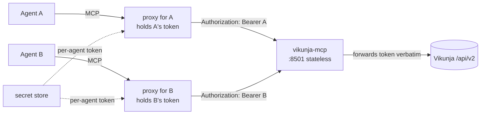

# Multi-agent deployment

How to run one `vikunja-mcp` behind a proxy layer so several agents share it while each
reaches Vikunja as itself.

If you have a single user and a single client, you do not need any of this — see
[clients.md](clients.md) and use `stdio`.

---

## The shape



`vikunja-mcp` holds **no** Vikunja credentials. Each proxy injects its own agent's token as
the `Authorization` header, and this server forwards it upstream unchanged.

Two properties follow, and they are the entire reason for the extra moving part:

- **Small blast radius.** Compromising this process exposes one in-flight request's token,
  never the whole set of agent credentials. A design where this server fetched tokens from
  a secret store would have to hold all of them.
- **Real attribution.** Every call reaches Vikunja *as the agent that made it*, so task
  authorship, comments and audit trails are per-agent for free rather than something you
  reconstruct from logs.

Any proxy that can inject a per-caller header works. [scoped-mcp](https://github.com/TadMSTR/scoped-mcp)
is one such layer and is what this server was built against, but nothing here depends on it.

---

## Wiring the tokens

1. **One Vikunja account per agent.** Not one account with several tokens — attribution is
   per *user* in Vikunja, so shared accounts collapse exactly what this design preserves.
2. **One API token per account**, from **Settings → General → API Tokens**. Scope it to what
   that agent actually does.
3. **Store each token in your secret manager**, resolved into the proxy's config at start.
4. **Never set `VIKUNJA_TOKEN` on the server.** With a network transport it is refused at
   startup, deliberately: a static token on a shared port makes every caller one identity.

A useful property when debugging: because the token *is* the credential and there is no
ambient fallback, a request with no `Authorization` header fails closed with an error that
names the passthrough model. "Every call is failing with `No Authorization header`" always
means the proxy is not injecting, never that the server is misconfigured.

---

## The grant model

Tool allowlists belong in the proxy, not here. This server exposes its full surface and
authorises nothing itself — it cannot, because it has no idea who is calling beyond the
token it is forwarding.

Give each agent the smallest tool set its job needs. A worked example, for an agent whose
role is *file a ticket, label it, link it, comment on it, move it across the board, close
it* — every destructive and administrative tool removed:

| Group | Tools | Why |
|---|---|---|
| Identity | `whoami` | verify token wiring |
| Projects (read) | `project_list`, `project_get` | read the structure, never create it |
| Tasks | `task_list`, `task_search`, `task_get`, `task_create`, `task_update` | core filing and status |
| Labels | `label_list`, `label_get`, `task_label_add`, `task_label_remove` | attach and detach from an agreed vocabulary; never mutate the vocabulary |
| Comments | `comment_list`, `comment_create` | notes on a ticket |
| Relations | `task_relation_add`, `task_relation_remove` | grouping related work |
| Assignees (read) | `task_assignee_list` | read only |
| Attachments | `attachment_list`, `attachment_upload` | attach a log or a diff |
| Board | `view_list`, `view_get`, `bucket_list`, `task_bucket_move` | read the board, move a ticket across it |

Two things that are easy to get wrong, both learned the hard way:

- **Label tools are not symmetrical with label *vocabulary* tools.** `task_label_add`
  attaches an existing label; `label_create` invents a new one. An agent that can invent
  labels will, and a shared taxonomy stops being shared. Grant the first, withhold the
  second.
- **Audit the grants you have deployed, not the grants you documented.** When one such
  deployment was read back from its live config, *every* agent's real grant was wider than
  the documentation claimed — in one case the entire 73-tool surface where 23 was intended.
  Documentation drifts in the permissive direction because widening a grant is what you do
  when something is broken at 2am, and narrowing it again is what you forget. Re-read the
  live config periodically and treat the doc as a claim about the past.

---

## Running the process

The container is the supported artefact — see [docker.md](docker.md) for the security model,
the read-only root, the audit-log mount and the webhook caveat.

Whatever supervises it, three things are worth setting up regardless:

**Validate config before starting.** `--check` parses the environment and exits non-zero on
a bad combination without starting the server or contacting Vikunja:

```bash
docker run --rm -e VIKUNJA_URL=https://vikunja.example.com \
  --entrypoint vikunja-mcp ghcr.io/tadmstr/vikunja-mcp:latest --check
```

It is cheap enough to run as a deploy preflight, and it turns the three startup refusals
(missing URL, `stdio` without a token, token on a network transport) into a named error
rather than a crash loop.

**Bind to loopback and let the proxy be the front door.**

```
-p 127.0.0.1:8501:8501
```

The publish is the access control. Binding `0.0.0.0` inside the container is not an
exposure decision — the container's network namespace is. Any process that can reach this
port can forward a Vikunja token it already holds.

**Health-check `/health`, not a tool call.** It is unauthenticated by design, returns no
configuration, and deliberately does not probe upstream Vikunja — this server is stateless
and recovers on its own, so a Vikunja restart marking the container unhealthy would cost a
needless restart loop and buy nothing.

**Pin the tag.** `:latest` moves. Deployments should pin `:vX.Y.Z` and take upgrades
deliberately; the release path attests build provenance, so you can verify what you pulled:

```bash
gh attestation verify oci://ghcr.io/tadmstr/vikunja-mcp:v0.10.1 --owner TadMSTR
```

> Verifying through the registry's OCI *referrers* endpoint will return
> `404 MANIFEST_UNKNOWN` even when the attestation exists — GHCR does not implement it. Use
> `gh attestation verify`, which reads GitHub's attestation API.

---

## Webhooks

Vikunja delivers webhooks to a URL you register with `webhook_create`. The target must be
reachable *from the Vikunja server*, which is a different network position than yours.

Watch for split-horizon DNS: if your Vikunja instance resolves your public hostname to a
private address, the SSRF guard will classify the target as non-routable and refuse it — a
correct refusal for a target that genuinely is internal. Register a genuinely external
target, or run the receiver where Vikunja can reach it.

See [../SECURITY.md](../SECURITY.md) for the guard's rules.

---

Related: [clients.md](clients.md) · [docker.md](docker.md) · [telemetry.md](telemetry.md) ·
[extension-hooks.md](extension-hooks.md)
